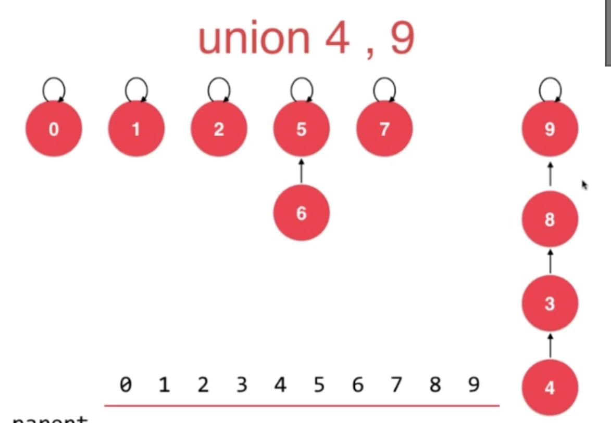
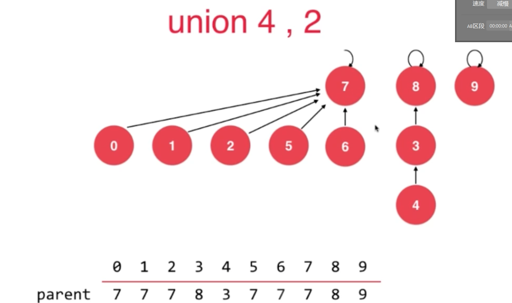

# 介绍：

解决连接问题，网络中节点是否连接和数学中集合类的并集

## 连接问题和路径问题的区别

## 并查集的两个动作：

## 并查集的数据表示

先说一个最简单的并查集：

我们用0--9给每个元素一个id编号，对于每一个元素，并查集存储的是元素它所属于的集合的id；

如下：id为0，2，4，6，8的元素都在同一个集合

## 真正的并查集

我们用0--9给每个元素一个id编号，对于每一个元素，并查集存储的是元素它所属于的集合的父节点的id编号；

每一个树，代表一个集合。树的根节点只是集合中的一个元素。比如下面，5，6，7元素在同一个集合；2，3，1在同一个集合

## 并查集的优化

UnionFind2.java

之前的并查集进行union操作的时候可能会造成每个集合的的深度过高，所以要进行合并时的优化操作

如果执行union4，9  因为9是一个单独的节点集合，如果将8这个子树移到9，树的高度就会过高；所以应该反过来

## 并查集的优化

UnionFind3.java

如果要nnion的话，应该是将7这个子树合并到8子树那里，这样才可以让最新的树的深度最小

