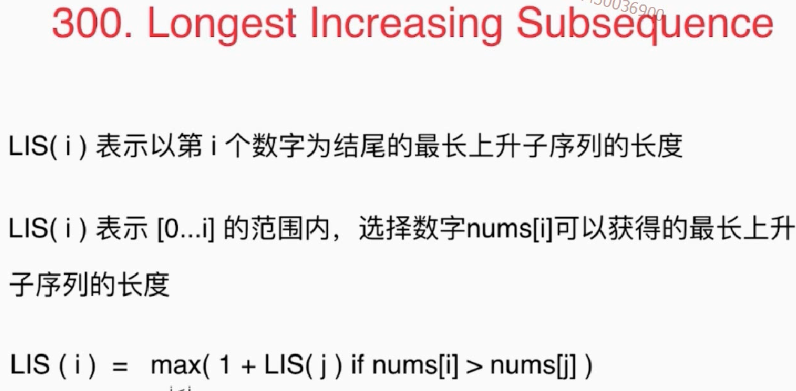

从斐波那契数列谈起  自顶向下使用记忆化搜索解决问题   动态规划，自底向上解决问题

# 动态规划  70  343


# 198  

## 具有最有子结构的动态规划

 


# 背包问题  状态函数具有两个参数


```
时间复杂度: O(n * C) 其中n为物品个数; C为背包容积空间复杂度: O(n * C)
```

# 背包问题变形 416


# 最长上升子序列300 





# 待做

  动态规划  120  64  279  91   62   63   213   337  309  322	377  474	139  494