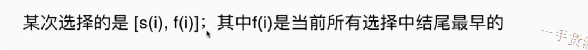

# 从分饼干谈起  455

# 435 区间不重叠

将问题转化为要保留的区间，再使用动态规划进行解题

贪心

# 贪心选择性质

在求解一个最优化的问题中，我们使用贪心的方式选择的一种内容之后，不会影响剩下的子问题的求解。

其实，一般验证是比较难的

比如，如下，可以举出反例，说明不成立

# 435贪心证明

使用数学的方法，数学归纳法，或者反证法； 下面使用反证法证明题目435的贪心算法是正确的

# 总结

贪心思想一般不会单独考，如果单独考的话都是很简单代码就可以实现的，一般不考证明原理

贪心一般会在某题解题过程中会被使用到

待做  392