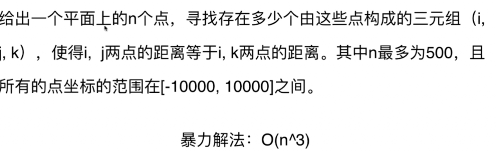

# 查找表

查找表主要讲了map和set的使用，hashmap和hashset都是O(1)级别的，Treemap和Treeset是O(logn)级别的

下面来看题目

# 1 两数之和，使用hashmap

但是不能先一次性将所有的元素放进查找表种，因为map结构可能会覆盖相同的值，如果target是82，它是由两个41组成，就会可能出问题。

# 454 四数之和使用hashmap

可以使用查找表进行优化

优化查找表

# 447 hashmap

# 219查找表+滑动窗口

在K长度的窗口中，如果找到了i，j相等，那么就是满足条件的解

如果l到l+k没有相同的元素，那么得l向前移动一位（滑动窗口）

再对比l+k+1这个元素与l+1 和l+k之前的元素有没有相同的元素。如果没有就继续滑动（滑动窗口）

# 待做

15 18  16  49  149