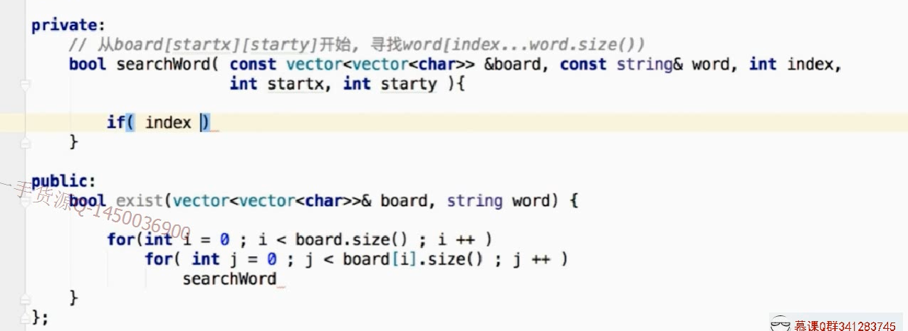
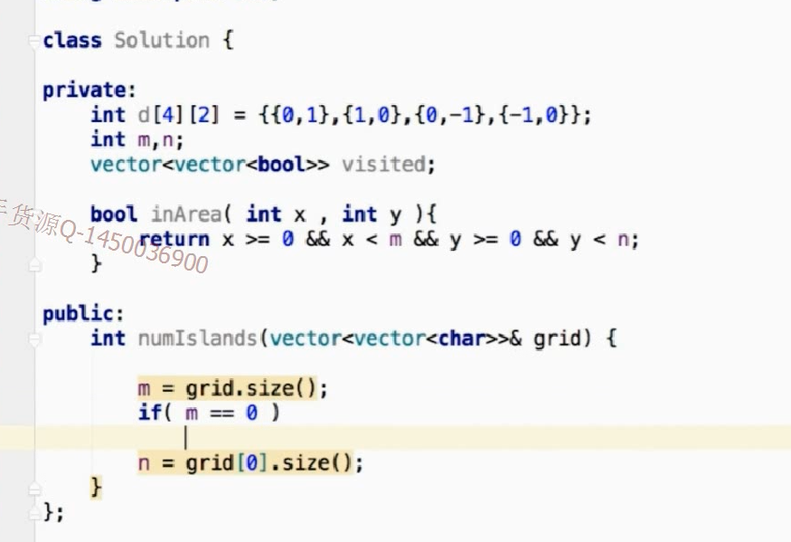

```
/**
 * 回溯法：回溯是递归的特性，一般说进行了元素的重置才是回溯(注意元素之间会相互影响的问题)
 * 
 * 排列  17   47（相比17，元素之间会相互影响）   
 * 组合  77
 * 平面范围的回溯问题  单词查找问题79  岛屿问题200  n皇后问题51
 * 
 * 
 * 待做： 排列  93  131  47  39 40  组合  216  78   90   401     floodfill 130 417   n皇后优化 52  37
 * 
 * 讲义： https://leetcode-cn.com/problems/permutations/solution/hui-su-suan-fa-python-dai-ma-java-dai-ma-by-liweiw/
 */
```


## 排列  46 


注意这里进行了剪纸


## 组合  77


这里进行了剪纸


## 二维平面的回溯-79





## 二维平面的回宿-洪泛200





## n皇后问题 51


如果第一行的在第一列


第二行的不能在第二列


可以在第三


如果第二行放第三列，第三行不能放皇后，所以第二行只能放在第四列


第二行放第四列


需要剪枝


观察对角线上的点的横纵坐标相加的值


